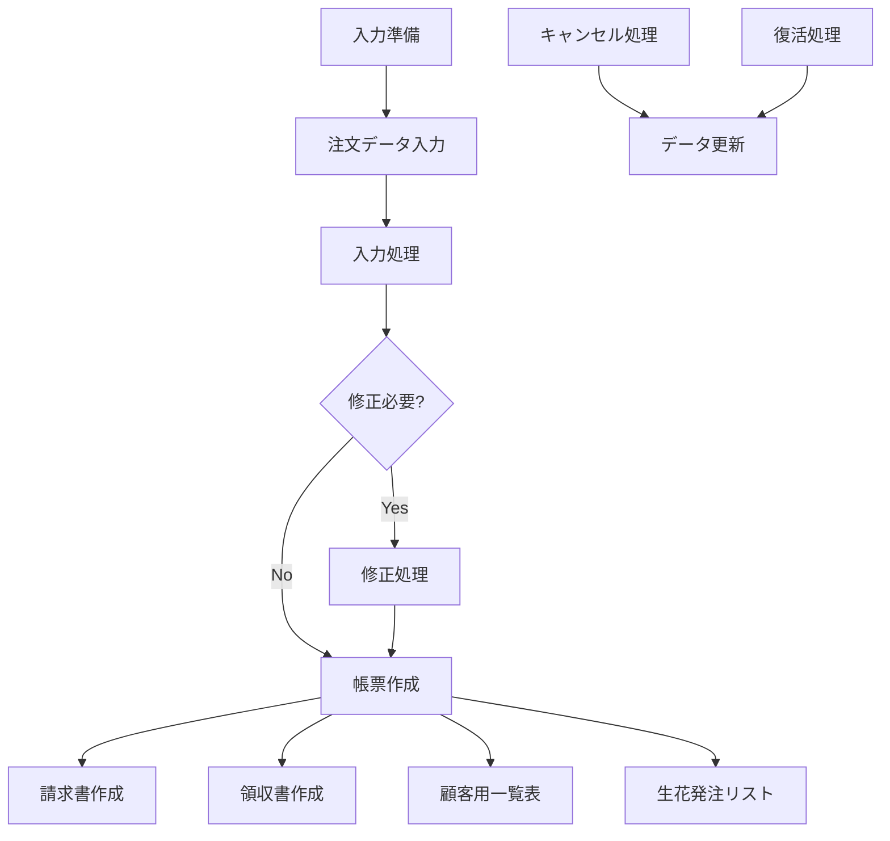

`macro.vb` ファイルを分析し、このExcel VBAマクロの処理の流れと仕様をまとめます。

## 概要
このマクロは**花の注文管理システム**で、葬儀などの花の注文から請求書・領収書発行まで一連の業務を管理するシステムです。

## 主要な機能とサブルーチン

### 1. 初期設定・入力準備系

#### `入力準備()`
- **目的**: 新規注文入力の準備
- **処理内容**:
  - 初回実行時は担当者名・葬儀確定日を入力
  - 各種カウンター（件数、金額等）を初期化
  - 注文書の入力フィールドをクリア
  - デフォルト値設定（金額：16,500円、手数料：2,200円）

#### `入力準備2()`
- **目的**: 修正用の入力準備
- **処理内容**: 修正シートの入力フィールドをクリア

### 2. データ入力・管理系

#### `入力()`
- **目的**: 注文データの入力と一覧表への登録
- **処理内容**:
  - 注文書から各種データを取得（受注日、金額、依頼者情報等）
  - 支払方法の判定（振込/現地）
  - 一覧表への登録
  - 合計金額の更新
  - 付け花の特別処理

#### `修正()`・`修正完了()`
- **目的**: 既存データの修正
- **処理内容**:
  - 指定されたNo.のデータを取得
  - 修正シートに展開
  - 修正後のデータを一覧表に反映

### 3. 帳票出力系

#### `請求書()`
- **目的**: 請求書の一括作成
- **処理内容**:
  - 請求書が必要な案件（"要"フラグ）を抽出
  - 別ファイルに請求書シートをコピー
  - 50件ごとにファイルを分割
  - 宛名ラベルも同時作成

#### `領収書()`
- **目的**: 領収書の作成
- **処理内容**:
  - 現地払いの案件のみ対象
  - 全印刷または個別印刷の選択
  - 50,000円以上は印紙マーク付与

#### `宛名ラベル作成()`
- **目的**: 請求書送付用の宛名ラベル作成
- **処理内容**: 請求先情報を宛名ラベルシートに出力

### 4. 一覧表作成系

#### `顧客用一覧表()`
- **目的**: 顧客向けの一覧表作成
- **処理内容**:
  - キャンセル以外のデータを抽出
  - 合計金額の表示形式調整（カンマ区切り）

#### `生花発注()`
- **目的**: 花屋への発注リスト作成
- **処理内容**: キャンセル以外の芳名板情報を抽出

### 5. データ管理系

#### `Cancel()`
- **目的**: 注文のキャンセル処理
- **処理内容**:
  - 指定No.をキャンセル状態に変更
  - 合計金額から除外
  - 行の色を変更（グレーアウト）

#### `revival()`
- **目的**: キャンセルした注文の復活
- **処理内容**: キャンセル処理の逆操作

## データ構造

### 主要シート
- **①注文書 (入力用)**: 新規注文の入力画面
- **②一覧表**: 全注文のマスターデータ
- **③花屋送信用**: 花屋への発注リスト
- **④請求書**: 請求書テンプレート
- **⑤領収書**: 領収書テンプレート
- **修正**: データ修正用画面
- **顧客用一覧表**: 顧客向け一覧
- **住所ラベル**: 宛名ラベル用データ

### 重要な管理データ（②一覧表）
- **列64(BL)**: 件数No.
- **列65(BM)**: 総合計金額
- **列66(BN)**: 手数料合計
- **列67-69**: 修正用一時保存
- **列70-73**: 請求書ファイル管理
- **列74-78**: その他管理情報

## 処理の流れ

## 特徴
1. **自動採番**: 件数No.の自動管理
2. **金額計算**: 付け花の有無による分別計算
3. **ファイル分割**: 請求書の50件単位での自動分割
4. **データ保護**: シート保護機能
5. **エラーハンドリング**: 重複処理の防止

このシステムは葬儀関連の花の注文業務を効率化するための包括的な管理システムとなっています。